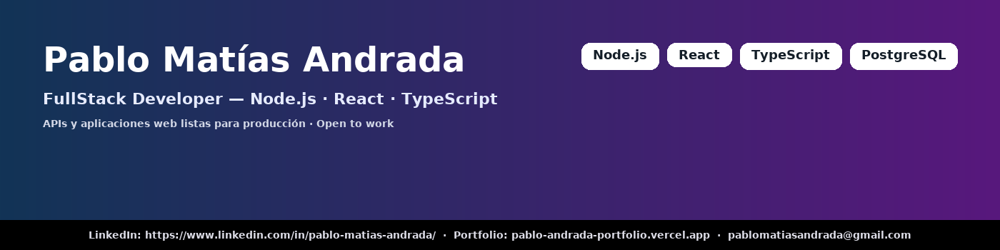

  

  👋 Hola! Gracias por tomarte el tiempo de visitarme!  te cuento,  soy **Pablo Matías Andrada**  
**FullStack Developer** · Node.js · React · TypeScript · Java · PostgreSQL  
📍 Pilar, Córdoba, Argentina · 📫 pablomatiasandrada@gmail.com  
🔗 [LinkedIn](https://www.linkedin.com/in/pablo-matias-andrada/) · [Portfolio](https://pablo-andrada-portfolio.vercel.app) · [GitHub](https://github.com/Pablo-Andrada)

---

### 🚀 ¿Qué construyo?
Desarrollo aplicaciones web y APIs listas para producción: diseño e implementación de **RESTful APIs** (Node.js / Java), frontends en **React**, despliegues automáticos desde GitHub (Vercel / Render) y pruebas automatizadas. Me enfoco en fiabilidad, seguridad y experiencia de usuario.

**Disponibilidad:** Open to work · Full-time / Part-time / Remoto / Relocalizable (Argentina)

---

### ⭐ Proyectos destacados
- **Shift-Application (Mechanic Workshop)** — *Sistema de reservas para taller* · **Node.js · Express · TypeORM · PostgreSQL · React**  
  Demo: [link](https://shift-application-1iwg.vercel.app) · Repo: [link](https://github.com/Pablo-Andrada/Shift-Application)  
  En uso diario por el cliente (≈50–150 reservas/mes)._

- **Foro-Hub (Oracle ONE)** — **Backend Java · Spring Boot · MySQL**  
  Repo: [link](https://github.com/Pablo-Andrada/Foro-Hub)

- **The Next Page** — *E-commerce demo (checkout integrado)* · **Node.js · Express · MongoDB · Stripe / Mercado Pago**  
  Demo: [link](https://the-next-page.vercel.app/home)

- **Rick & Morty App** — Frontend React  
  Demo: [link](https://rick-and-morty-project-zeta-one.vercel.app) · Repo: [link](https://github.com/Pablo-Andrada/RickAndMorty-Project)

---

### 🧰 Tech:

  
  
  
  
  
  
  
  
  
  
  
  
  
  
  
  
  

---

### 🎓 Educación

- **Licenciatura en Ciencias de la Computación** — Universidad Nacional de Córdoba (Facultad de Matemática, Astronomía, Física y Computación) — En curso
- **Carrera de Programador Web Full Stack — Henry** — Certificado
- **Carrera Especialidad Backend** — Oracle Next Education (ORACLE + Alura Latam) — Programa Avanzado : Java · Spring · Cloud (OCI) · MySQL · IA — En curso (Dic 2024 – Dic 2025)
- **Inglés:** B2 Upper Intermediate — EF SET English Certificate
  

---

### 📊 Estadísticas

  <table>
    <tr>
      <td></td>
      <td></td>
      <td></td>
    </tr>
  </table>

---

### 🤝 Contacto
📩 pablomatiasandrada@gmail.com · [LinkedIn](https://www.linkedin.com/in/pablo-matias-andrada/)
